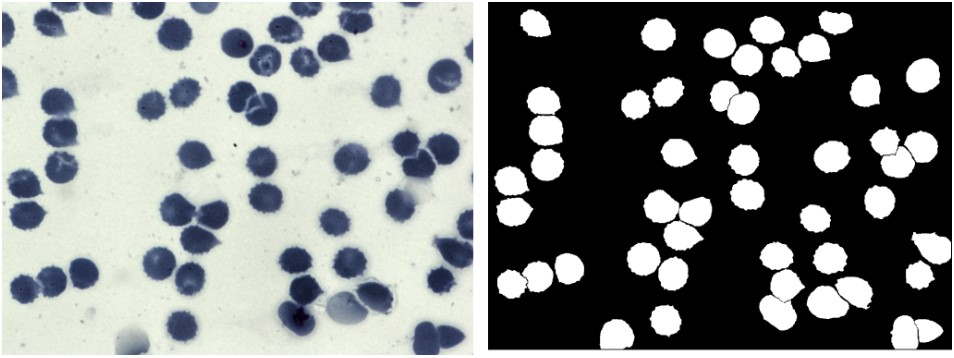

# Introduction

The goal of this project is to use different computer vision techniques to segment the image, then count all the objects presented and after that to compare the results.
Possible approaches:

1. To use some CV algorithm for both segmentation and counting;
2. To use come ML model for segmentation and then count.

Dataset for this project is “Blood Cell Segmentation Dataset” free available on [Kaggle](https://www.kaggle.com/datasets/jeetblahiri/bccd-dataset-with-mask). A total of 2656 images are available. 1328 Original blood cell images with 1328 corresponding ground truths.


# First approach: Watershed algorithm

The algorithm visualizes an image as a topographic landscape, producing ‘catchment basins’ and ‘watershed ridge lines’ within the image to segregate different objects.
In a simplified manner, any grayscale image can be viewed as a topographic surface where high intensity denotes peaks and hills while low intensity denotes valleys.


As the first step was to make out of RGB image a grayscale one because colours in this case are not needed. On top of it was used threshold with Otsu algorithm.

```python
gray = cv2.cvtColor(img,cv2.COLOR_BGR2GRAY)

# Threshhold + Otsu algorithm
ret, thresh = cv2.threshold(gray,0,255,cv2.THRESH_BINARY_INV+cv2.THRESH_OTSU)
```

Output:


Despite of being not very noisy (at least this particular one) these images are still better to denoise because it is a common approach which provides better performance.

```python
# Noise removal
kernel = np.ones((3,3),np.uint8)
kernel

opening = cv2.morphologyEx(thresh,cv2.MORPH_OPEN,kernel,iterations=2)
```


The next step was to fill the “holes” in the cells to be able to use the watershed algorithm.

```python
# Filling the holes
test = opening.copy()

th,im_th = cv2.threshold(test,220,255,cv2.THRESH_BINARY_INV)
im_floodfill = im_th.copy()
h,w = im_th.shape[:2]

mask = np.zeros((h+2,w+2), np.uint8)
cv2.floodFill(test,mask,(0,0),255)
im_floodfill_inv = cv2.bitwise_not(test)
im_out = im_floodfill_inv + opening.copy()
```


Using of the watershed algorithm consists of the number of important steps where the right order is essential. First of them is a distance transform.
The distance transform (sometimes called the Euclidean distance transform) replaces each pixel of a binary image with the distance to the closest background pixel. If the pixel itself is already part of the background, then this is zero. The result is an image called a distance map.
There are different distance types, that could be used depending on the task. For this case after some trial with six of them was obvious, that there is no noticeable difference.


After applying a distance transformation image is separated into following regions: “sure it is the foreground”, “sure it is the background”, “not sure” (last one by subtracting the other two from one another).

```python
ret, sure_fg = cv2.threshold(dist_transform_2,0.5*dist_transform_2.max(),255,0)
```


```python
sure_fg = np.uint8(sure_fg) # casting as an integer

unknown = cv2.subtract(sure_bg,sure_fg)
```


After that so-called markers are used to mark the objects, located in the foreground.

```python
ret,markers = cv2.connectedComponents(sure_fg)

markers = markers + 1

markers[unknown==255] = 0
```


```python
markers = cv2.watershed(img,markers)
```


Finally, findContours() method is used to count the number of cells.

```python
contours,hierarichy = cv2.findContours(markers.copy(),cv2.RETR_CCOMP,cv2.CHAIN_APPROX_SIMPLE)

for i in range(len(contours)):
  if hierarichy[0][i][3] == -1:
    cv2.drawContours(img,contours,i,(255,0,0),10)

plt.imshow(img,cmap='gray')
print('Objects number is:', ret-1)
```

Objects number is: 60


**Algorithm counted 60 cells which is a very high result – when counting per hand it is around 62**.

# Second approach: U-NET model

The U-NET is convolutional network architecture for fast and precise segmentation of images. The main idea is to supplement a usual contracting network by successive layers, where pooling operations are replaced by upsampling operators. Hence these layers increase the resolution of the output. A successive convolutional layer can then learn to assemble a precise output based on this information.


After downloading the dataset data had to be prepared for training. Some of the images were in .png, some in .jpg, so it had to be taken into account both for images and masks.

```python
images = os.listdir(image_directory)
images.sort()
for i, image_name in enumerate(images):    #Remember enumerate method adds a counter and returns the enumerate object
    if (image_name.split('.')[1] == 'png' or image_name.split('.')[1] == 'jpg'):
        image = cv2.imread(image_directory+image_name, 0)
        image = Image.fromarray(image)
        image = image.resize((SIZE, SIZE))
        image_dataset.append(np.array(image))
```

After normalization was done one more important step: sanity check.

```python
#Sanity check, view few mages
import random
import numpy as np
image_number = random.randint(0, len(X_train))
plt.figure(figsize=(12, 6))
plt.subplot(121)
plt.imshow(np.reshape(X_train[image_number], (256, 256)), cmap='gray')
plt.subplot(122)
plt.imshow(np.reshape(y_train[image_number], (256, 256)), cmap='gray')
plt.show()
```


If no attention was paid to it, it could severely damage the results if there are too many of such pairs. So different ways to fix it were tried, the best one in this case was to use sort() method.

The next step was to create and prepare the model. The model was first used without any changes or manipulations, but in this state it did not learn.

Among other changes were attempts to change the model build (does not help), change the batch size 32 => 16 => 1 (does help a little), were tried different amount of epochs to see whether the model just need much more of them to perform (which was not the case).
Turning point was to change the learning rate from 0.001 to 0.0001. After that change model performed straight away. Epochs = 10 was enough (were tried several times using early stopping => always stopped around this point).


IoU metric also showed a good score:

```python
#IOU
y_pred=model.predict(X_test)
y_pred_thresholded = y_pred > 0.5

intersection = np.logical_and(y_test, y_pred_thresholded)
union = np.logical_or(y_test, y_pred_thresholded)
iou_score = np.sum(intersection) / np.sum(union)
print("IoU score is: ", iou_score)
```

IoU score is: 0.8274875328678938

Probably the most important value was the counted number of cells on the same image as the watershed algorithm counted 60 (the model have not seen this image not only while training but also during evaluation). **The number was also 60**.


